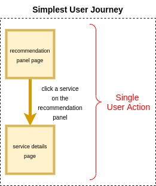
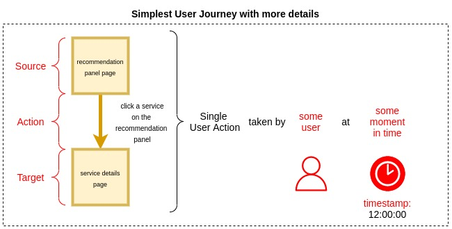
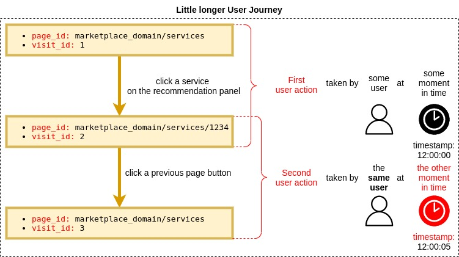
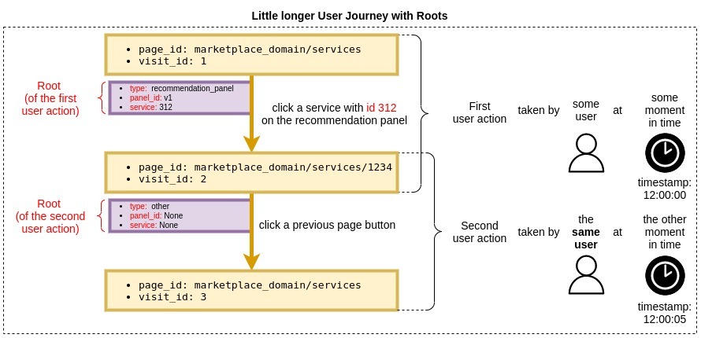
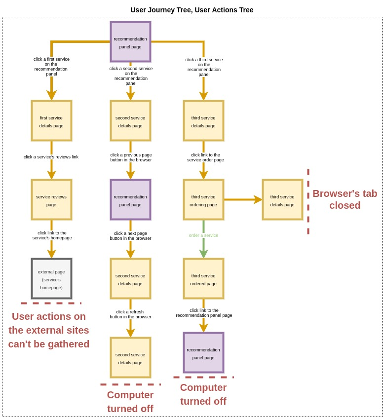
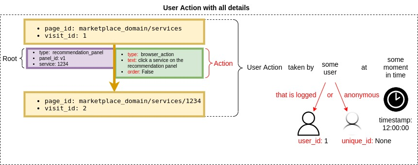

# Session Gathering

In order to train RL based recommender system, we need to have data about **users' reactions to presented recommendation panels**.

### User Journey
When a user is presented with the recommendation panel he can click on one of the recommended services or not. If he clicks he can go to the service's details, review, clicks links on the services page, go back, go next, compare services, etc. In the end, the user can order the service or not. He can also go back to the page with the recommendation panel and everything starts again. This is the so-called **User Journey** (through the marketplace portal).

### Session Gathering Problem
User journey captures the user's interest in the recommendations. The following challenge arises:
How to efficiently gather all this data in the way it is useful for RL training.
Challenging aspects:
- there can be thousands of users
- each of them can have multiple user journeys
- each user journey can branch into the tree: when a user opens a few links in new tabs/windows.

### Session Gathering Problem solution: User Actions
The solution can be obtained with the so-called **user actions**. Each link click, each next/previous page/refresh etc. is a user action.

For instance, the user may see the recommendation panel and then click on one of the recommended services, and then access the service's information page.
As we can see this user action has a source (the page with the recommendation panel) and the target (page with the service's details). Furthermore, it is associated with the user (who may be anonymous or logged in). Additionally, every user action has a timestamp. We can also say something about the action itself: it can be associated with the service order or not.

Described above user activity is the simplest **User Journey** that consists of only one **User Action**:

[comment]: <> ()

If we take a closer look we can see that our user action consists of the following elements:
- source
- action
- target
- user: 1 (id of the user)
- timestamp: 12:00:00

It is depicted in the following image:

But what exactly are these elements? Let's start with the source and target and take a closer look at the user journey.

Let's say that the user starts his journey on the main marketplace catalogue page with the URL `marketplace_domain/services`. We will call this URL a `page_id`. If the user begins there, it indicates that this is his first visit to this page. We can assign the unique `visit_id=1` to this visit. Following that, the user may click on one of the recommended services, and then he will go for example to the `marketplace_domain/services/1234` (path of the specific service). Again we can assign this visit with the unique `visit_id=2`. There are a lot of choices for the user what to do next: go to service's details, go to service's reviews, click some external links to the service's homepage etc. But our user clicked the `previous page` button. As a result, he is now back on the `marketplace_domain/services` but this is his second visit on this page and each visit has a unique id so `visit_id=3` is assigned to this particular one.

This little longer journey can be visualised as follows:

It could be concisely written as follows:

User Journey:
- First user action:
  - source:
    - page_id: marketplace_domain/services
    - visit_id: 1
  - action: click a service on the recommendation panel
  - target
    - page_id: marketplace_domain/services/1234
    - visit_id: 2
  - user: 1
  - timestamp: 12:00:00

- Second user action:
  - source:
    - page_id: marketplace_domain/services/1234
    - visit_id: 2
  - action: click a previous page button
  - target
    - page_id: click a previous page button
    - visit_id: 3
  - user: 1
  - timestamp: 12:00:05

So far so good but there are multiple services in the recommendation panel. We would like to know which one exactly has been clicked by the user. Moreover, there can be multiple versions of the recommendation panel (for example because of A/B testing). All this information could be stored in the so-called **Root** of the given user action.

If so, we have to update user actions in our user journey diagram:

As we can see the first user action's source page is the recommendation panel so there is appropriate data in the root. The root's **type** is set to recommendation_panel, there is also root's **panel_id** to specify the version of the recommendation panel. Of course, there is the root's **service** because we want to know which one exactly has been clicked.

The root is quite different in the second user action. This user action is from the service page (as stated in the source page_id) to the recommendation panel page (as stated in the target page_id). This user action hasn't a recommendation panel in its source, so we don't store anything in the root, we only mark that the root has type "other" (it will be useful later).

Now we can update also our concise representation of this user journey:
User Journey:
- First user action:
  - source:
    - page_id: marketplace_domain/services
    - visit_id: 1
  - root:
    - type: recommendation_panel
    - panel_id: v1
    - service: 312
  - action: click a service on the recommendation panel
  - target
    - page_id: marketplace_domain/services/1234
    - visit_id: 2
  - user: 1
  - timestamp: 12:00:00

- Second user action:
  - source:
    - page_id: marketplace_domain/services/1234
    - visit_id: 2
  - root:
    - type: other
    - panel_id: None
    - service: None
  - action: click a previous page button
  - target
    - page_id: click a previous page button
    - visit_id: 3
  - user: 1
  - timestamp: 12:00:05

### Branching, User Actions Tree

As previously stated, the user may open any link in a new tab or window and continue his journey there, the user can even switch tabs and resume his adventure in another location. The user is able to perform it numerous times in parallel.

This is exactly the point when the user actions start to be useful. While the user is on the website, he generates user actions that form the user actions tree due to parallel tabs/windows. This complicated user journey can be called **User Journey Tree**.

Example:

The user sees the recommendation panel and opens each service in the new tab. Then in the first tab, he goes to the service's reviews page, and then he clicks the external link to the service's homepage. In the second tab, the user clicks on the previous page, the next page and finally the refresh button, and then he turns off his computer. In the third tab, the user goes to the service's ordering page, and then he clicks on the "order" button, but before that, he wanted to remind himself of some info about the service, so he opened the service's details in the new tab. After that, he switched back to the tab with the ordering, and he clicked a link back to the recommendation panel page in this tab. Then he closed the tab with the service details. At this moment the user started to think about coffee and he has turned off his computer.

This is an exemplary user journey that involves **branching** and forms a **User Actions Tree**. Because it's a little bit more complex we will skip part of user actions' details, and we will focus on these most important for this concept in the below visualization:

At the top of the above diagram, there is a rectangle that symbolises the visit on the recommendation panel page (it is violet as the other two recommendation panel pages in this diagram). There are also visits on other marketplace pages (such as service details, reviews, service ordering page, etc.) - they are yellow. There is also a grey rectangle that represents a visit on the external page. Each branch of this tree has its leaf where it ends. They are marked with red dashed lines and descriptions with causes of the end of the activity. All of these visits are connected with actions drawn as arrows. One of these arrows is green - it means this was an **ordering action**.

Of course, every two visits (rectangles) that are directly connected with the action (arrow) are all together with a user action as we could see in the previous diagrams. On the other hand, all these user actions form (by binding user actions with matching source/target visit ids) a User Actions Tree (or User Journey Tree).

Notice that some nodes in this tree are repeated (e.g. second service details page) but they are drawn as separate rectangles. It is due to the fact that each rectangle represents a visit on some page, not the page itself and, as you probably remember, every visit is unique, even on the same page. It is very important to understand that each user action connects two visits, not pages. For these reasons user actions never form a cyclic graph or even DAG - it is always a tree even if from the user's point of view he visits the same page multiple times.

We could see that some of the user actions are special - they lead to the **order** of the service. Moreover, we would like to store some context information, like user actions' **type** or **text**, for further processing.

There is also a need to identify both logged and anonymous users to gather activity in their sessions via user actions. Due to this fact, there should be a unique_id for the identification of anonymous users and user_id for logged ones. Why not just one field? Because IDs of these two types of users have different formats: database integer ID for the logged user and Universally Unique ID in the form of the hash string for the anonymous one. Also, we can set the proper one field to None to mark which type of user we are dealing with for the given user action.

Now we can complete our user action with the few missing details:

Let's also make the final update to our text description of the user action:
User action:
- source:
  - page_id: marketplace_domain/services
  - visit_id: 1
- root:
  - type: recommendation_panel
  - panel_id: v1
  - service: 312
- action:
  - type: browser_action
  - text: click a service on the recommendation panel
  - order: False
- target
  - page_id: marketplace_domain/services/1234
  - visit_id: 2
- user_id: 1
- unique_id: None
- timestamp: 12:00:00

We have just constructed fully capable user action!

##### WARNING!
Detailed and up-to-date schemas of user actions and recommendations jsons can be found in the recommender **SWAGGER**. See the readme file for information on how to launch it.

### Session gathering process details

We now know:
- what exactly is a user action
- that user actions can form a tree that fully mirrors the user Journey through the marketplace portal with all important details.
- that each user is sending user actions during his journey
- that user can be logged in or anonymous.

From the architectural point of view, there are marketplace and recommender. When some user (logged or not) visits the marketplace portal, appropriate user actions are sent to the recommender system in a near-line fashion. From the point of view of the recommender system, there is an almost continuous stream of user actions from marketplace's users. On the other hand, there are of course recommendation requests and responses.

The anatomy of the recommendation is following:
Recommendation:
- user
- unique_id
- timestamp
- visit_id
- page_id
- panel_id
- engine_version
- services
- search_data

where most of the fields are similar to the user action and have the same meaning but there are also new ones:
- engine_version: each recommendation can be handled with the chosen recommendation algorithm,
- services: the list of the services recommended by the system,
- search_data: search phrase and filters chosen by the user during viewing a services list on the page with the recommendation panel.

User actions and recommendations are key data for learning the machine learning algorithms behind the recommendation system. Because of that, all recommendations and user actions are stored in the recommender database each time they are generated.

Although this crucial data are stored in the recommender DB they have to be properly processed into the form that can be digested by the reinforcement learning-based recommendation algorithms. This form is a SARS.

SARS is a tuple of the following entities: state, action, reward, next state. In the context of the marketplace recommender system each of these entities has the following meaning:
- state: user, his history of interest in services and his chosen search data (see recommendation),
- action: services recommended to the user by the recommender system,
- reward: the value that represents the user's interest in the services recommended to him by the recommender system,
- next state: user and his history of interest in services and his chosen search data after seeing a recommendation.

The process of formation of SARSes out of the recommendations, user actions and user's ordering history is called SARSes generation and it is carried out by the SARSes generator.

# SARSes generator

As we could see earlier, the user actions can form a tree. Each such tree has a root in the visit on the page with the recommendation panel. Because recommendation visit IDs are compatible with user action visit IDs, if the source visit ID of a user action is the same as the visit ID of a recommendation, it indicates that the user performed this user action after seeing the recommendation. It is a user reaction to the recommendation. It will be used to measure user interest in the recommendation. If he has done more user actions that followed the first one, all of them are important. The whole user actions tree is a reaction to the recommendation. Where does it end? It ends when all branches of the given user action tree end. When the branch of the user action tree ends? It ends at the moment of seeing the next recommendation by the user (then the whole process starts again but for the next recommendation and SARS) or when the user orders a service or when there is no next user action.
Of course, if there are two branches in the user actions tree rooted in some recommendation A and after some user actions in the first branch there occurs a next recommendation B and after that, there are new user actions on the second branch - they aren't taken into consideration while generating the SARS associated with the recommendation A.

The user actions (done by the user as an aftermath of seeing a recommendation) have assigned proper values (by the recommendation algorithm) and they are all collected and mapped into the overall reward value that represents the user's interest in the services recommended in the recommendation panel. The maximum interest of the user occurs when he ordered all services that he has seen in the recommendation panel. The minimum is when he doesn't click any of these services. If the user clicks some of the recommended services and optionally click some next links associated with these services, then he shows a partial interest.

To carry out its task efficiently SARSes generator uses multiprocessing and can automatically find and regenerate SARSes that need it (for example if after a long pause a user sends more user actions associated with the user actions tree that is connected to the recommendation on which the SARS is based on).
